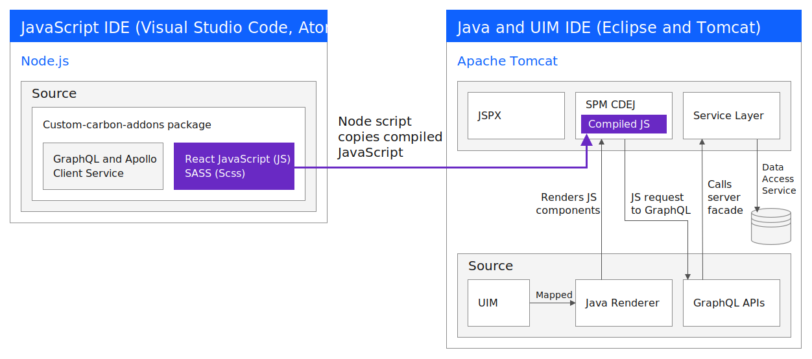

This open source repository provides a React JavaScript development environment for Merative™ Social Program Management. You can now extend UIM by using React, IBM® Carbon Design System, GraphQL, and Apollo Client.
You can create complex views with React JavaScript components based on Carbon and render them on a UIM page in Social Program Management.

Social Program Management developers can:

- Use a lightweight JavaScript development environment that complements the existing Java™ and UIM web client development environment.
- Develop complex views with the latest front-end tools and libraries, and integrate them into the Social Program Management web client.
- Develop front-end content quickly and iteratively. JavaScript developers can view their changes without a client build.
- Use GraphQL and Apollo Client to configure complex data queries. JavaScript Developers can use mock GraphQL APIs to enable rapid development of custom components and test them in the development environment (not shown in diagram).
- Build robust front-end content through easier test automation.

The Social Program Management UI Addon Development Environment provides:

- Documentation: Instructions to get up and running in a JavaScript environment, with examples and design guidance.
- Code: Commands to integrate your compiled JavaScript into the Social Program Management web client.
- Samples: Some sample React components that contain IBM Carbon styles and GraphQL queries.
- Storybook: You can use Storybook to render components locally for testing.
